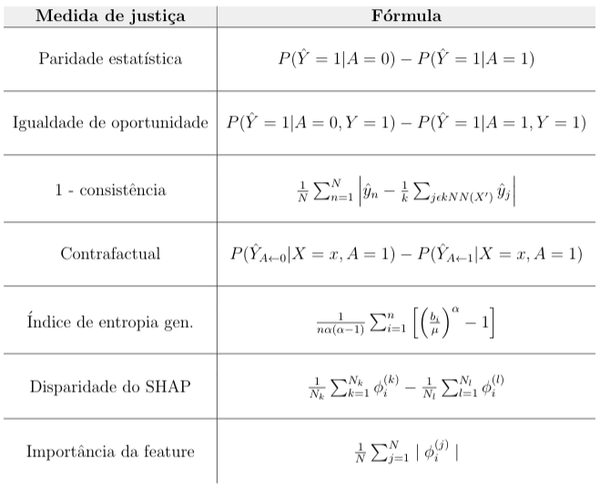

## Avaliação de Discriminação em ML usando SHAP

Preconceitos presentes na sociedade podem criar vieses em modelos aprendidos a partir de dados. Para avaliar a existência de viés, alguns pesquisadores propõem o uso de definições de "justiça", enquanto outros usam técnicas de interpretabilidade. Porém, parece não existir nenhum estudo que compara as medidas de justiça (através de várias definições de justiça) e os resultados de interpretabilidade (através de várias noções de interpretabilidade). Esse repositório contém a implementação de metodologias para examinar e comparar esses resultados, ele é uma continuação do que foi feito [nesse outro repositório](https://github.com/cesarojuliana/feature_importance_fairness). A ideia da metodologia implementada é avaliar como as medidas de justiça e o resultado de interpretabilidade variam em um modelo com viés e em outro sem viés. Focamos no uso do SHAP (SHapley Additive exPlanations) como técnica de interpretabilidade, que usa conceito da teoria dos jogos cooperativos para calcular a contribuição de cada feature em uma previsão gerada pelo modelo; apresentamos resultados com alguns datasets propensos a injustiça.

Nós usamos as seguintes medidas de justiça: paridade estatística, igualdade de oportunidade, consistência, justiça contrafactual e índice de entropia generalizado.

Propomos medidas para avaliar o resultado do SHAP de forma global, com um resultado por modelo, que chamamos de importância da feature e disparidade do SHAP.

A tabela abaixo contém a fórmula das medidas que foram usadas.



Nas equações acima, A é a feature sensível, sendo o valor 1 do grupo privilegiado e 0 do grupo desprivilegiado.

Nós usamos 5 datasets: Adult, German, Default, COMPAS e PNAD. Todos foram avaliados com 4 modelos: Random Forest, Gradient Boosting, Regressão Logística e SVM. Usamos as seguintes técnicas do SHAP:

- Kernel SHAP: aplicada em todos os modelos
- Tree SHAP: aplicada nos modelos Random Forest e Gradient Boosting
- Linear SHAP: aplicada no modelo de Regressão Logística

### Dependências do projeto

No projeto foi usada a versão 3.6 do Python. Todas as dependências do projeto podem ser encontradas no arquivo `requirements.txt`, para instalá-las execute na pasta raiz do projeto: 

```
pip install -r requirements.txt
```


### Estrutura do projeto

**Pastas**

- `dataset`: contém os datasets utilizados nesse trabalho: Adult, German, Default, COMPAS e PNAD
- `data`: datasets processados e divididos em treino e teste, e resultados de fairness e do SHAP
- `models`: local para salvar modelos treinados como pickle. Arquivos gerados pelo notebook `RunFairness.ipynb`
- `res_temp`: local para salvar resultados gerados pelo processo de `main_fairness.py` como pickle para diversos modelos e datasets. Como esse processo demora muito tempo salvamos resultados intermediários.  Arquivos gerados pelo notebook `RunSHAP.ipynb`
- `result_image`: Local para salvar imagens geradas pelo SHAP. Arquivos gerados pelo notebook `RunSHAP.ipynb`

**Arquivos python**

- `fairness.py`: funções base das medidas de fairness
- `main_fairness.py`: funções base para rodar o processo de fairness
- `main_shap.py`: funções base para os cálculos de medidas e gráficos do SHAP

**Notebooks**

- `RunFairness.ipynb`: Notebook que roda o processo para calcular as métricas de fairness
- `RunSHAP.ipynb`: Notebook que roda o processo para calcular o resultado do SHAP
- `Análise disparidade entre grupos.ipynb`: Avaliação da existência de viés nos datasets, com quantificação da proporção dos valores da variável alvo do dataset de acordo com o grupo da variável sensível 
- `EDA - PNAD.ipynb`: Análise exploratória dos dados do PNAD
- `PNAD - Efeito variação variável sensível.ipynb`: Avaliação do resultado do modelo com a variação do valor da variável sensível
- `Análise resultados.ipynb`: Análise dos resultados obtidos com as medidas de justiça e do SHAP